# ChatGPT

ChatGPT（Chat Generative Pre-trained Transformer），是美国 OpenAI 开发的人工智能聊天机器人程序，于 2022 年 11 月推出。该程序使用基于 GPT-3.5、GPT-4 架构的大型语言模型并以强化学习训练。ChatGPT 目前仍以文字方式交互，而除了可以用人类自然对话方式来交互，还可以用于甚为复杂的语言工作，包括问答搜索、写作翻译、总结分析、求解方程、修复和调试代码等多种任务。

# 准备工作

 - 一个可以[科学上网](https://github.com/alphazcc/Scientific-Internet-access)的工具，提供非 China 网络环境，开启全局代理
 - 一个国外手机号用于接收验证码，这里使用俄罗斯接码平台 SMS-Activate 辅助完成验证
 - 建议浏览器开启无痕模式

# 主要步骤

- ChatGPT 账号注册
- 手机号验证
- 愉快地玩耍 ChatGPT

## Step1 ChatGPT 账号注册
**1.1 打开浏览器无痕模式，开启科学上网工具全局代理，进入 [注册入口](https://openai.com/blog/chatgpt/)**

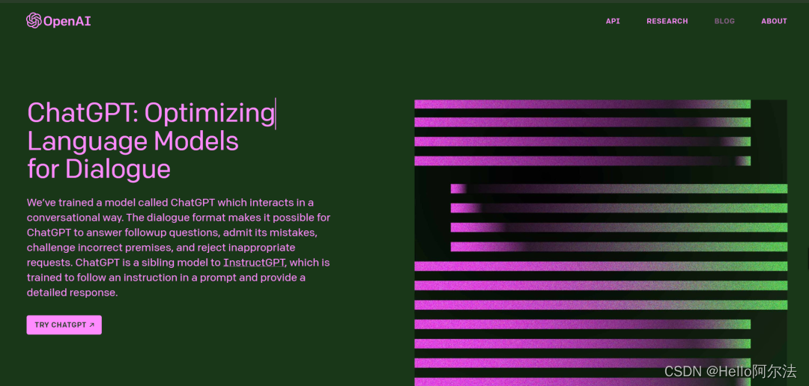

**1.2 点击【TRY CHATGPT】进入注册/登录页面**

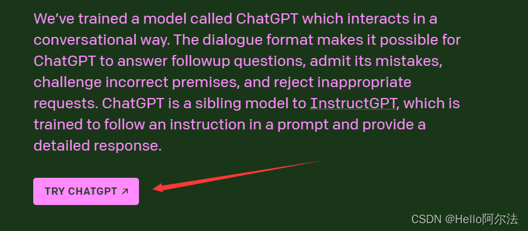

**1.3 点击【Sign up】注册**

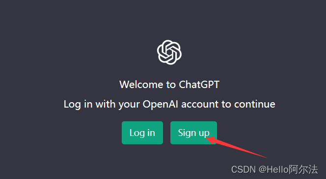

**1.4 使用邮箱注册，输入完毕后点击【Continue】**

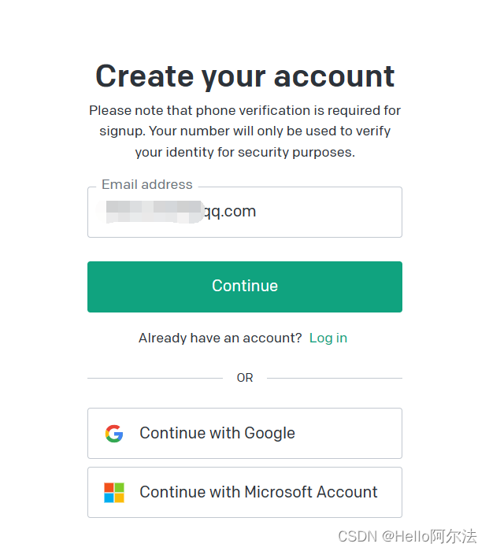

**1.5 设置登录密码，至少 8 个字符，输入完毕后点击【Continue】**

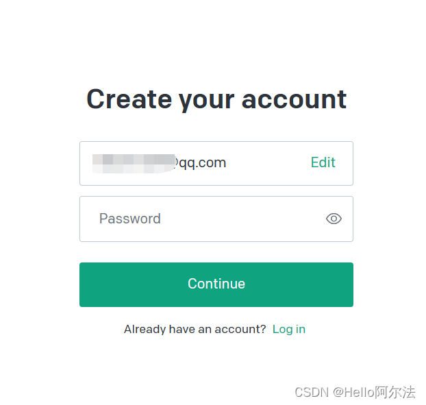

**1.6 邮箱验证，注册邮箱会收到 OpenAI 发送的一封验证邮件，进入邮箱查看邮件，点击验证按钮完成验证**

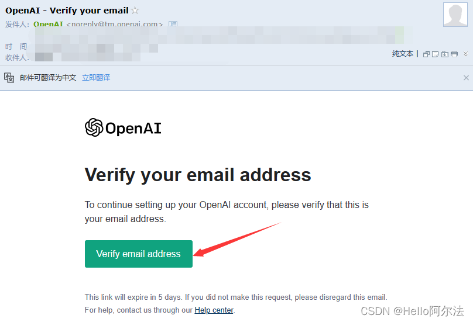

**1.7 简单填写一下你的名字**

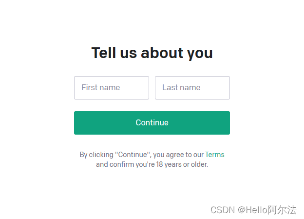

**1.8 进入手机号验证阶段**

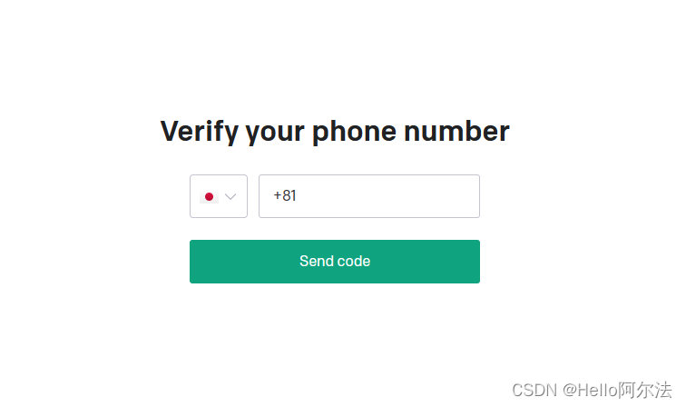

## Step2 手机号验证
**2.1 打开 [俄罗斯接码平台 SMS-Activate ](https://sms-activate.org/) 辅助完成验证**

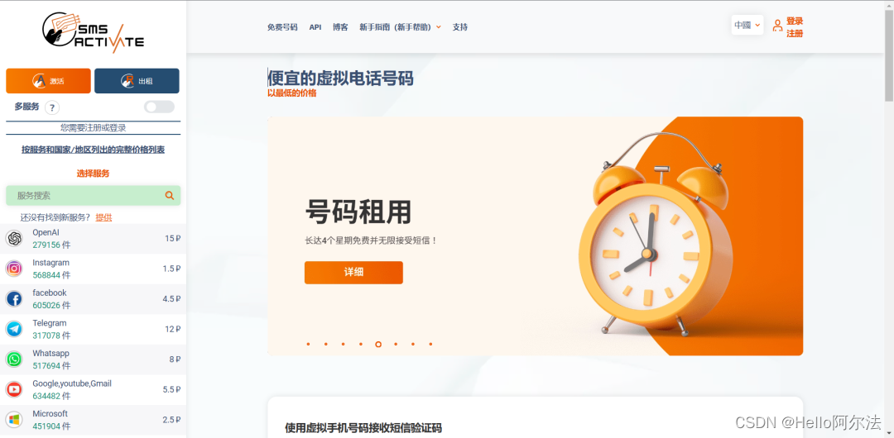

**2.2 右上角点击【注册】，填写邮箱、密码，还需要进入邮箱验证一下**

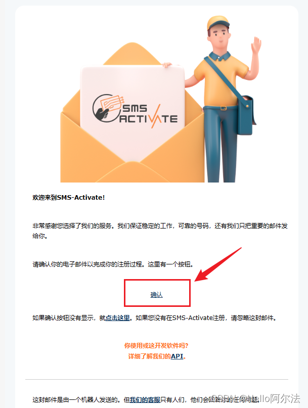

**2.3 登录 SMS-Activate，右上角点击【充值】**

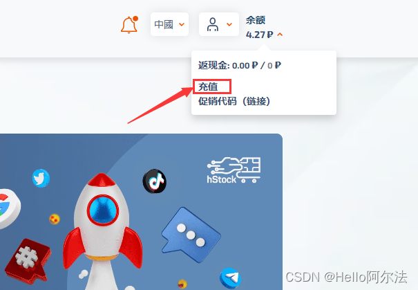

**2.4 支付方式下拉选择【支付宝】**

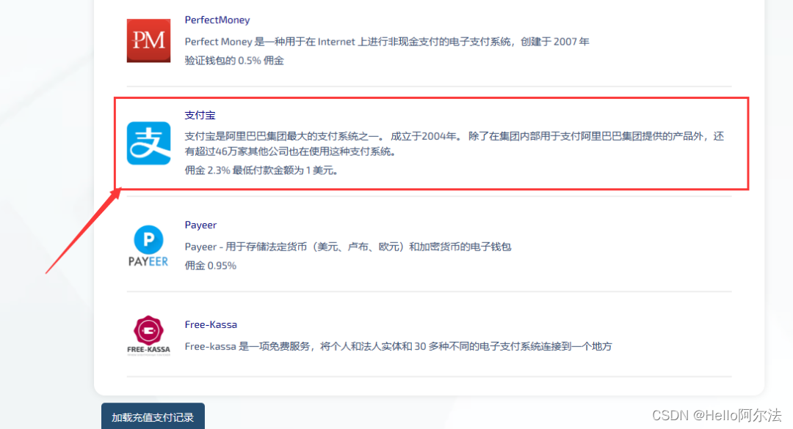

**2.5 按需填写充值金额，点击支付，当前 1 美元约 6.8 元人民币**

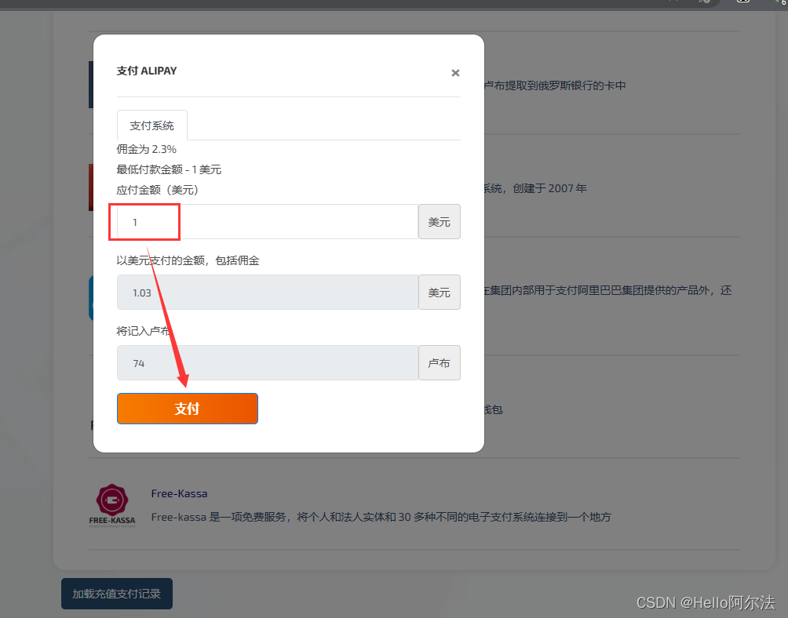

**2.6 使用支付宝扫码支付即可**

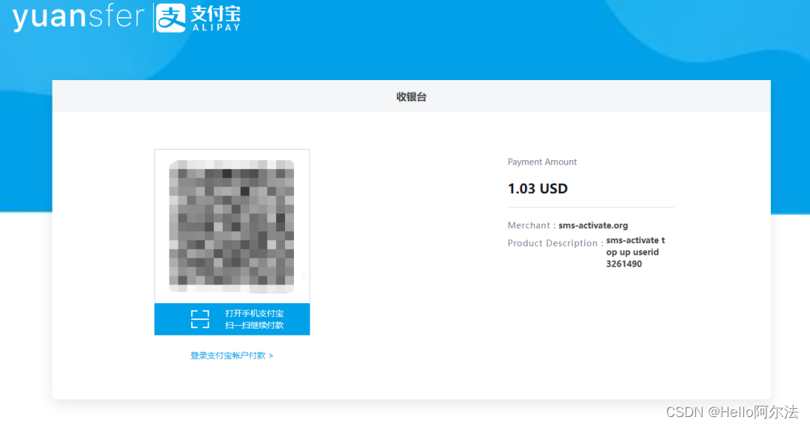

**2.7 支付成功后跳转回到主页，搜索“OpenAI”，在【服务】中选择一个国家，点击【加购】**

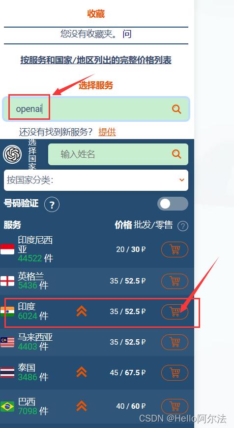

**2.8 此时便拥有一个虚拟手机号了，注意要在20分钟内完成注册**

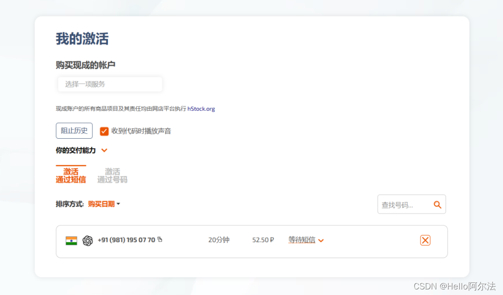

**2.9 将手机号复制到手机号验证那里，国家要选择正确，点击【Send code】**

**2.10 回到 SMS-Activate，查看验证码**

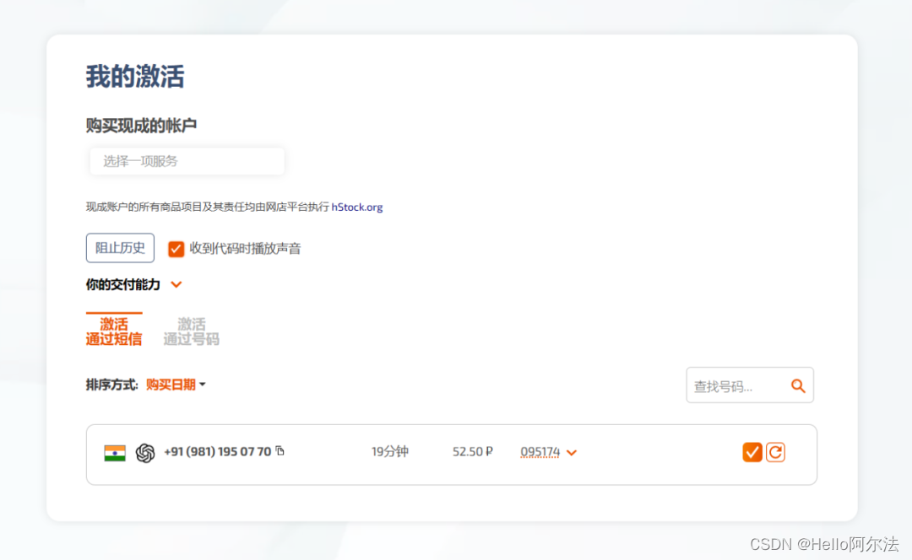

**2.11 填写验证码后完成验证**

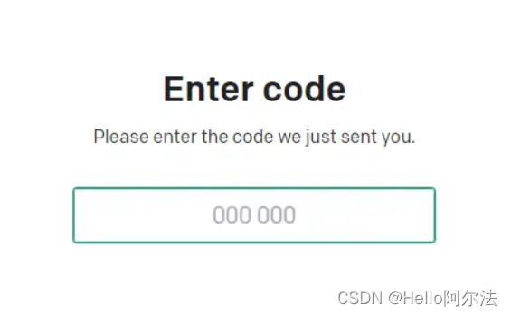

## Step3 愉快地玩耍 ChatGPT
**登录 ChatGPT，接下来就可以愉快地玩耍啦**

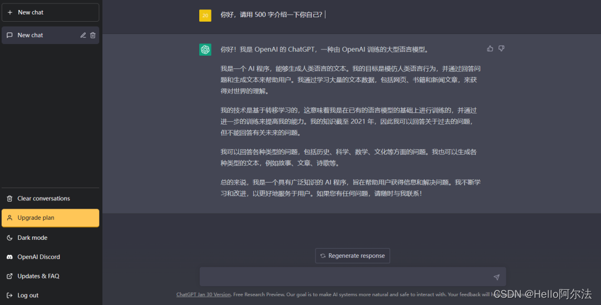
