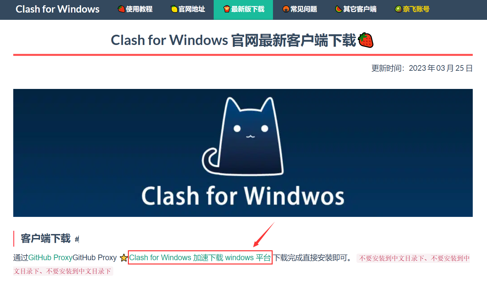
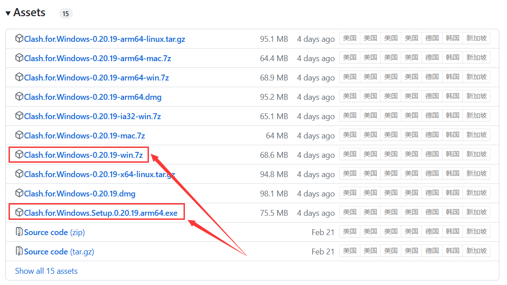
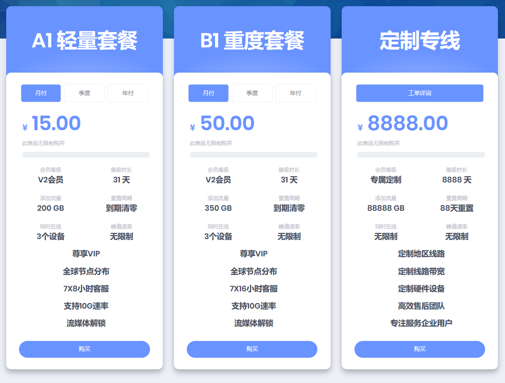
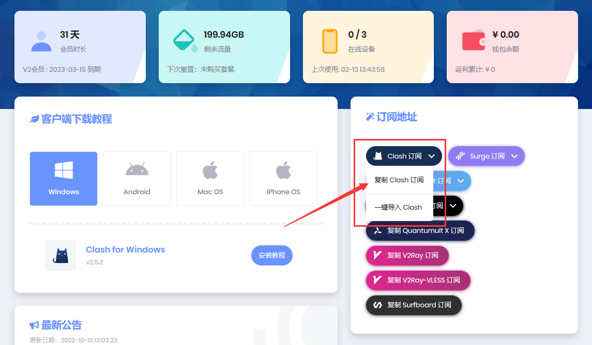
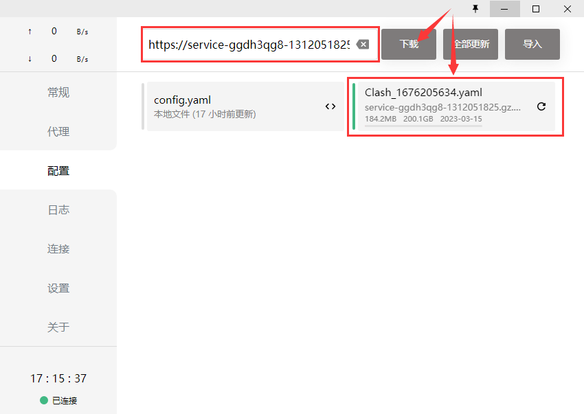
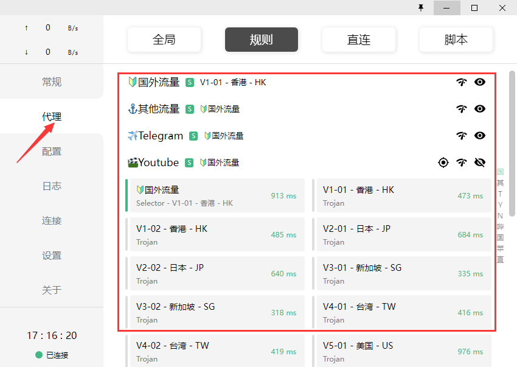
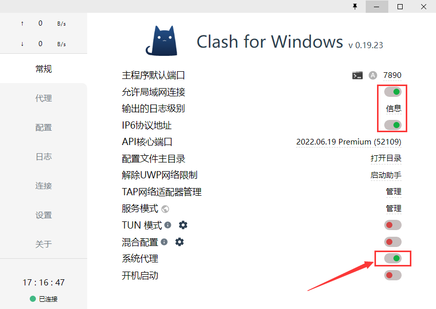

## Step1 准备工具

**安装 Clash for Windows 客户端**

- [Clash for Windows 官网下载](https://clashforwindows.top/download/) 

- [Github 下载](https://github.com/Fndroid/clash_for_windows_pkg/releases) 安装程序或者免安装版皆可

## Step2 配置订阅

**以 [全球通](https://www.goingv2pro.com/user) 为例，一般 *轻量套餐* 就够用了**

*PS: [全球通](https://www.goingv2pro.com/user) 现在涨价了，建议另辟便宜好用的订阅…*

**购买订阅后“复制 Clash 订阅”链接或者“一键导入 Clash”皆可**

**若“复制 Clash 订阅”链接，则将其粘贴到 `配置` 中，点击 `下载` 即可**

**其他订阅使用方法类似**

## Step3 使用方法

**切换到 `代理` 一栏，共有三种代理模式**

- 全局（Global）：所有请求直接发往代理服务器

- 规则（Rule）：所有请求根据配置文件规则进行分流

- 直连（Direct）：所有请求直接发往目的地

**以 `规则模式` 为例**

- 点击你想要的节点即可选中；

- 点击“无线”图标可以检测延迟等。

## Step4 愉快玩耍

**切换到 `常规` ，打开 `系统代理`**

- `允许局域网连接` 选项默认关闭，如果需要局域网共享可以打开；

- `IP6 协议地址` 可按需配置。

**畅通无阻~**

## 订阅推荐

- [一元机场](https://xn--4gq62f52gdss.com/#/login)

- [奶茶Cloud](https://naichayun.net/#/login)

- [Fly Airport](https://12315.cn.com/user)
