# QSPI Flash 固化程序

普通的 FPGA 一般是可以从 Flash 启动，或者被动加载，ZYNQ 的启动是由 ARM 主导的，包括 FPGA 程序的加载，ZYNQ 启动一般为最少两个步骤，在 UG585 中也有介绍。

- Stage 0：**BootROM 阶段** 在 ZYNQ 上电复位或者热复位之后，处理器首先执行 BootRom 代码，这一步是最初始启动设置。BootRom 存放了一段用户不可更改的代码，代码里包含了最基本的 NAND，NOR，Quad-SPI，SD 和 PCAP 的驱动，在非 JTAG 模式下才执行。另外一个作用是把 stage 1 的代码搬运到 OCM 中，就是 FSBL（First Stage Boot Loader）代码。

- Stage 1：**FSBL 阶段** 当 BootRom 搬运 FSBL 到 OCM 后，开始执行 FSBL 代码，FSBL 主要有以下几个作用：
	- 初始化 PS 端配置，这些配置也就是在 Vivado 工程中对 ZYNQ 核的配置。包括初始化 DDR，MIO，SLCR 寄存器。主要是执行 ps7_init.c 和 ps7_init.h，ps7_init.tcl 的执行效果跟 ps7_init.c 是一样的。
	- 如果有 PL 端程序，加载 PL 端 bitstream
	- 加载 SSBL（Second Stage Boot Loader）或者 bare-metal 应用程序到 DDR 存储器
	- 交接给 SSBL 或 bare-metal 应用程序
	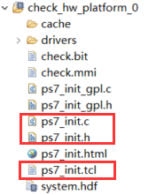

- Stage 2：**SSBL 阶段** SSBL 是可选项，一般是在跑系统的情况下使用，比如 Linux 系统的 u-boot。

## 创建 FSBL

FSBL 是一个二级引导程序，完成 MIO 的分配、时钟、PLL、DDR 控制器初始化、SD、QSPI
控制器初始化，通过启动模式查找 bitstream 配置 FPGA，然后搜索用户程序加载到 DDR，最后
交接给应用程序执行。详情请参考 UG821 文档。

-  新建一个 APP

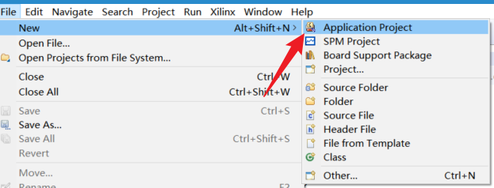

- 命名为 fsbl，特别注意选择最新的那个硬件平台，点击 Next

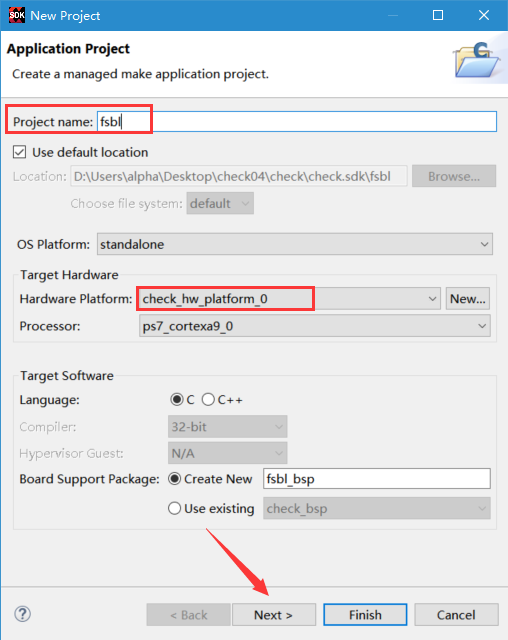

- 模板选择 Zynq FSBL，点击 Finsh

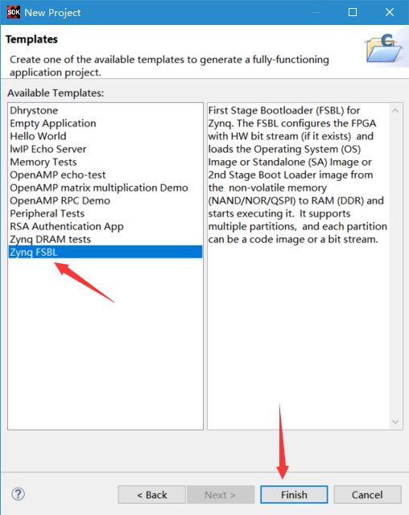

- 在 `fsbl_debug.h` 添加调试宏定义 `FSBL_DEBUG_INFO`，可以在启动时输出 FSBL 的一些状态信息，有利于调试，但是会导致启动时间变长。

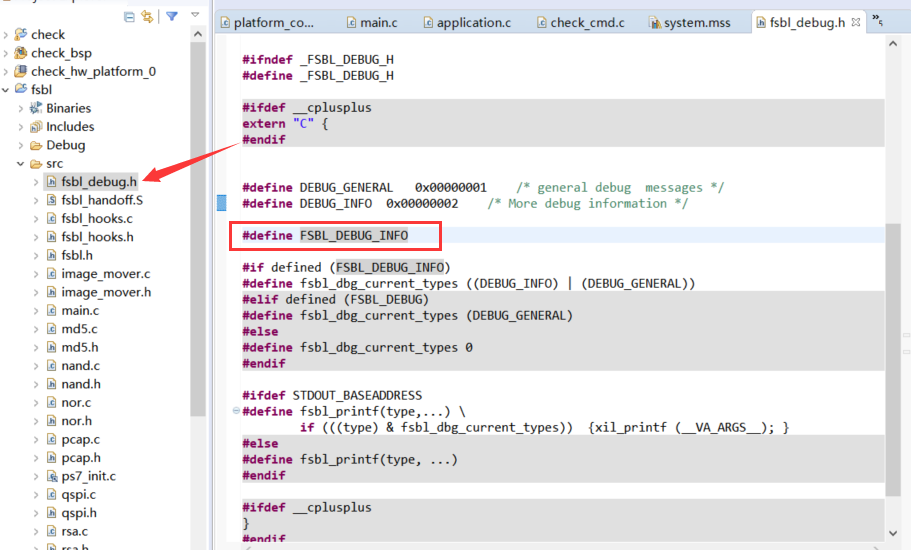

 - 修改后保存，SDK 默认会自动编译，生成 fsbl.elf 文件。

## 创建 BOOT 文件

- 选择 APP 工程，右键选择 Create Boot Image

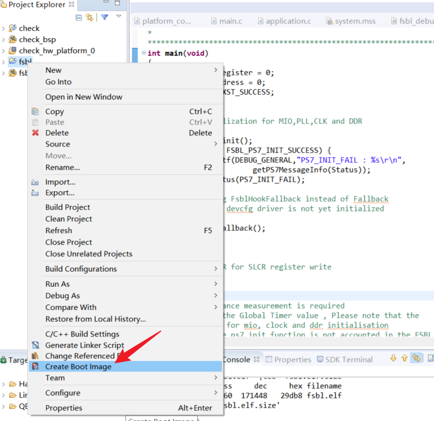

- 弹出的窗口中可以看到生成的 BIF 文件路径，BIF 文件是生成 BOOT 文件的配置文件，还有生成的 BOOT.bin 文件路径，BOOT.bin 文件是我们需要的启动文件，可以放到 SD 卡启动，也可以烧写到 QSPI Flash。

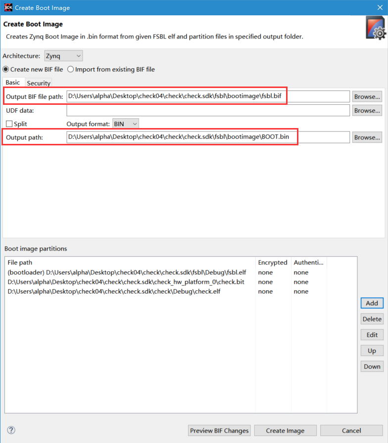

- 在 `Boot image partitions` 列表中是要合成的文件，第一个文件一定是 `bootloader` 文件，即上面生成的 `fsbl.elf` 文件，第二个文件是 FPGA 配置文件 `bitstream`，在本实验中为 `check.bit`，第三个是应用程序，在本实验中为 `check.elf`，点击 `Create Image` 生成。

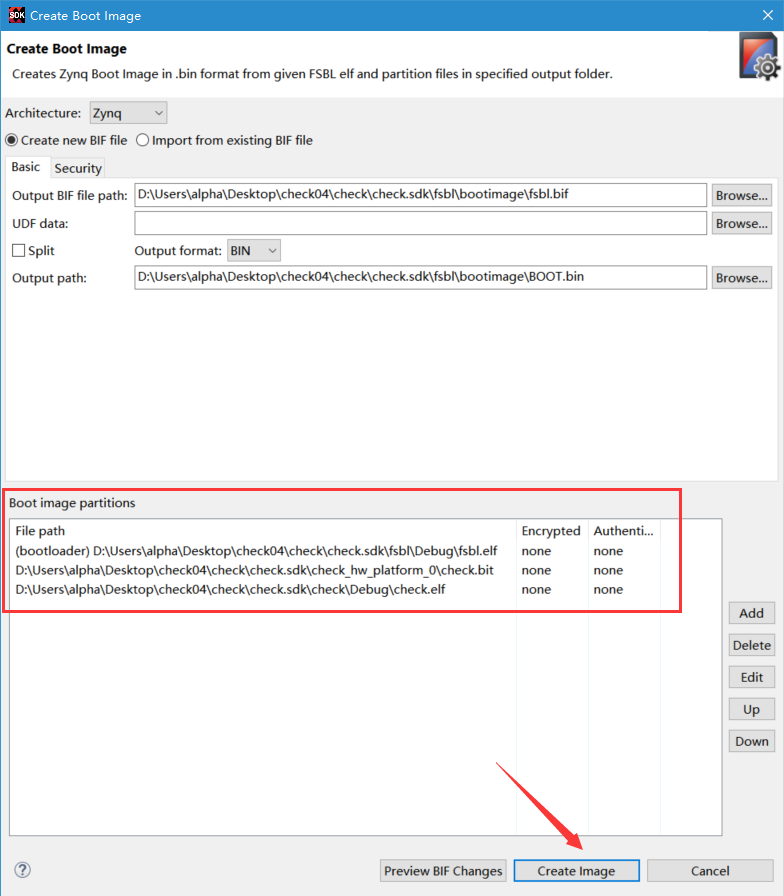

- 在生成的目录下可以找到 `BOOT.bin` 文件。

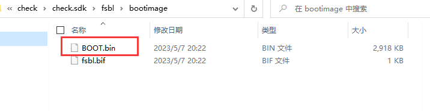

## QSPI 烧写启动测试

- 在 SDK 菜单 Xilinx -> Program Flash

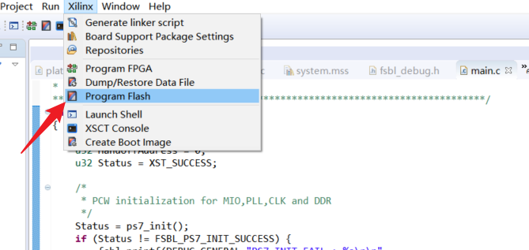

- `Hardware Platform` 选择最新的，`Image FIle` 文件选择要烧写的 `BOOT.bin`，`FSBL file` 选择生成的 `fsbl.elf`，`Flash Type` 选择 `qspi_dual_parallel`，点击 `Program` 等待烧写完成。

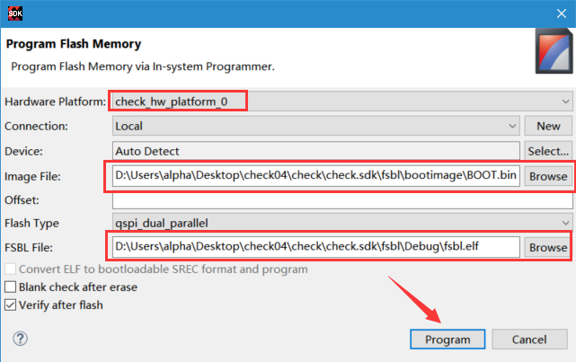

注：如果烧写时不是 JTAG 启动模式，软件会给出一个警告，所以建议烧写 QSPI 的时候设置到 JTAG 启动模式

- 断电，设置启动模式为 `QSPI`，上电重启，可以看到 ZYNQ 已在运行。

## 使用批处理文件快速烧写 QSPI

- 新建一个 `program_qspi.txt` 文本文件，扩展名改为 `bat`，内容填写如下：

```
set XIL_CSE_ZYNQ_DISPLAY_UBOOT_MESSAGES=1
call D:\Software\Xilinx17\SDK\2017.4\bin\program_flash -f BOOT.bin -offset 0 -flash_type qspi_dual_parallel -fsbl fsbl.elf -verify
pause
```

- 其中 `set  XIL_CSE_ZYNQ_DISPLAY_UBOOT_MESSAGES=1` 设置显示烧写过程中的 uboot 打印信息，
`D:\Software\Xilinx17\SDK\2017.4\bin\program_flash` 为我们工具路径，按照安装路径适当修改，`-f` 为要烧写的文件，`-fsbl` 为要烧写使用的 `fsbl` 文件，`-verify` 为校验选项

- 把要烧录的 `BOOT.bin`、`fsbl`、`bat` 文件放在一起

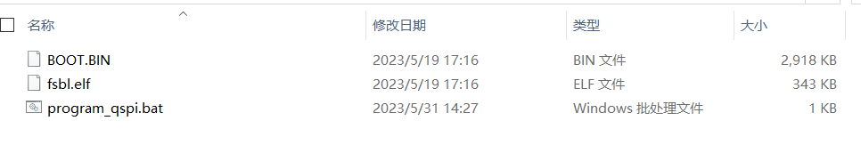

- 插上 JTAG 线后上电，双击 bat 文件即可烧写 flash

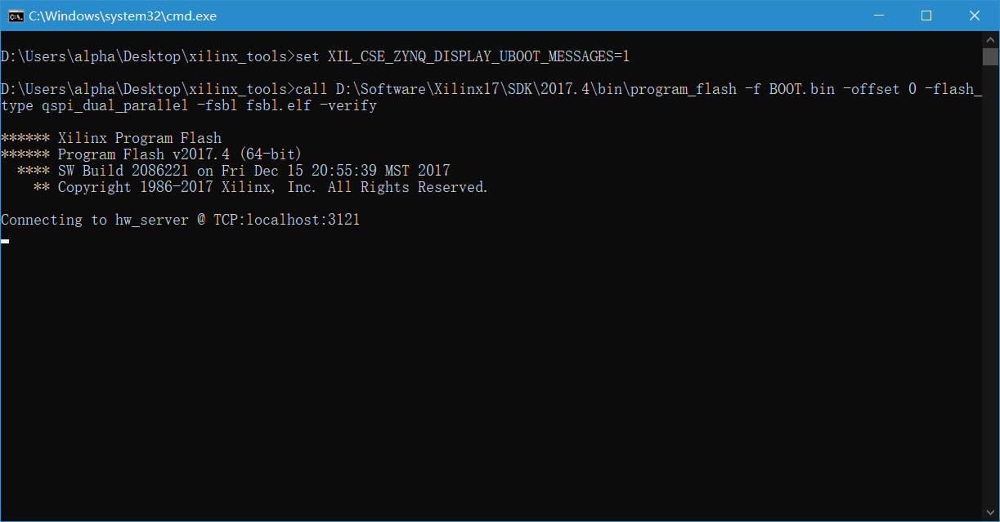

**测试平台**：黑金 AX7Z035

**芯片型号**：XC7Z035-2FFG676