# 制作 Linux 的 QSPI Flash 启动文件

本期介绍如何使用 PetaLinux 配置生成从 QSPI Flash 启动的 Linux 镜像文件。

## 复制 Petalinux 工程

如果我们想保留 SD 卡启动的 Petalinux 工程，但是又不想新建一个，我们可以把老工程复制一份。

- 在工程目录同时按键 Ctrl +H，显示隐藏文件，将 project-spec、.petalinux、config.project 复制到一个新的目录，作为一个新的 Petalinux 工程

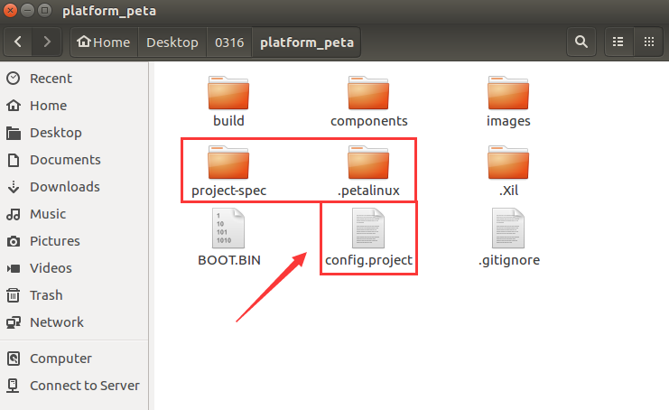

- 再把 images/linux 目录下的 bit 文件也复制到新的工程目录下，用于合成带 PL 配置的 BOOT

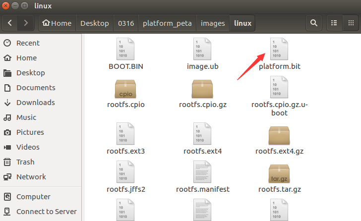

- 进入新工程，右键选择打开终端

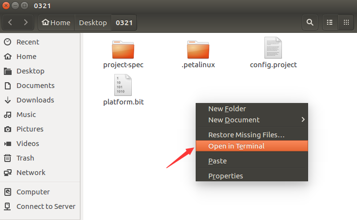

## 配置编译 Petalinux

- 配置 Vivado 和 Petalinux 环境变量

```c
source /opt/pkg/petalinux/settings.sh
source /opt/Xilinx/Vivado/2017.4/settings64.sh
```

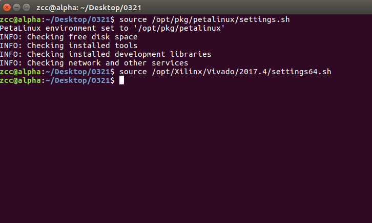

- 使用 `petalinux-config` 命令配置 `Petalinux` 工程

```c
petalinux-config
```

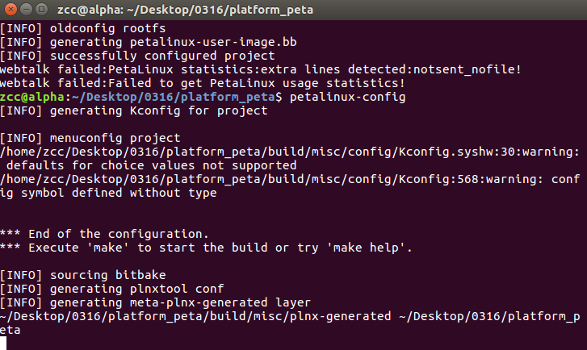

- 进入 Petalinux 配置界面

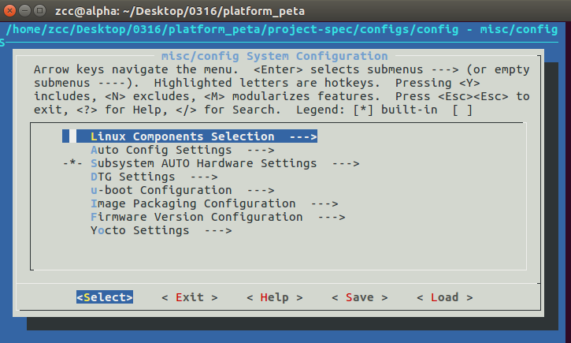

- 在 `Subsystem AUTO Hardware Settings ---> Advanced bootable images storage Settings --->
boot image settings ---> image storage media` 选项中选择 `primary flash`

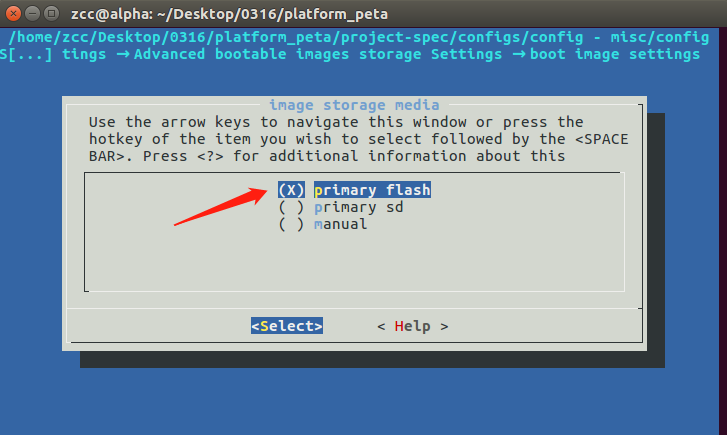

- 在 `Subsystem AUTO Hardware Settings ---> Advanced bootable images storage Settings --->
kernel image settings ---> image storage media` 选项中选择 `primary flash`


- 在 `Subsystem AUTO Hardware Settings → Flash Settings` 中可以修改 `QSPI flash` 的分区，默认的
就差不多可以使用，如果你的文件大小超过了默认分区的大小，要自己调整一下

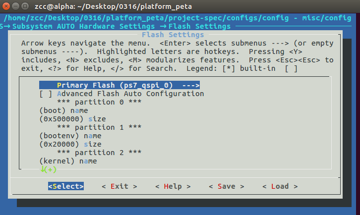

- 在 `Image Packaging Configuration ---> Root filesystem type` 选择 `INITRAMFS`，使用 `RAM` 类型
的根文件系统，这样就可以方便打包烧写到 `QSPI Flash`

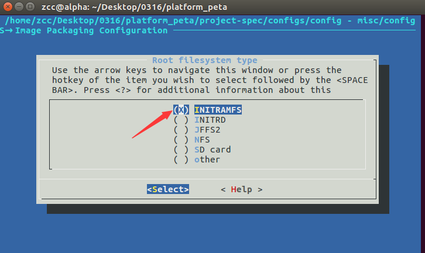

- 在 `Firmware Version Configuration` 中可以修改 `Host name` 等信息

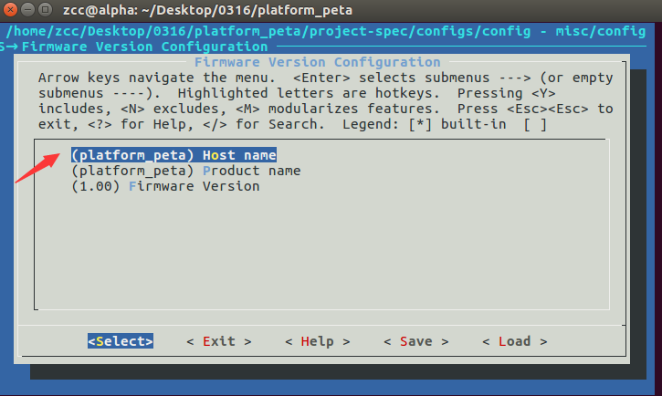

- 保存配置

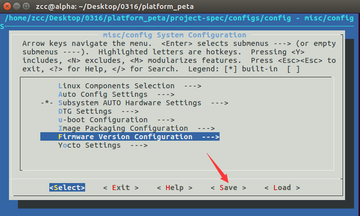

- 退出并编译

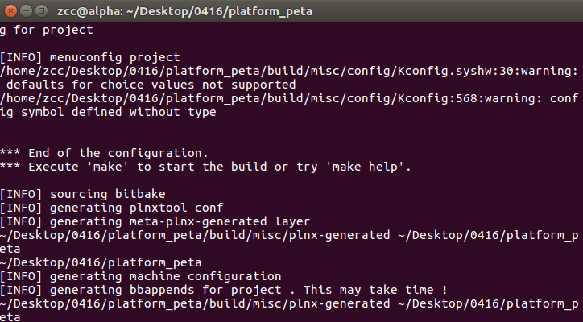

- 使用 `petalinux-build` 命令编译工程

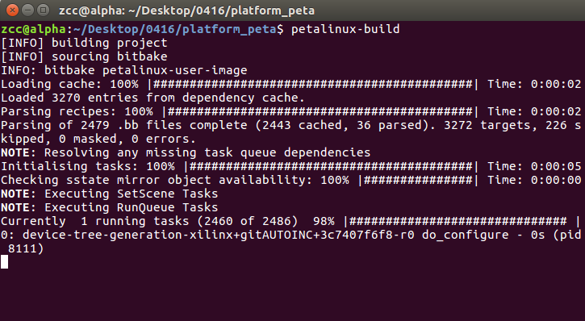

- 使用下面命令合成 BOOT，和前面的教程的差异就是多出 `--kernel` 选项，把内核也打包到
BOOT.bin 文件里

```c
petalinux-package --boot --fsbl ./images/linux/zynq_fsbl.elf --fpga ./images/linux/platform.bit --u-boot --kernel --force
```

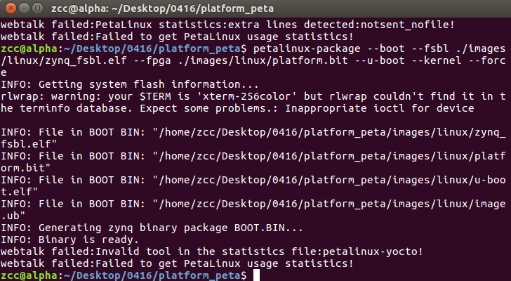

- 生成 bin 文件

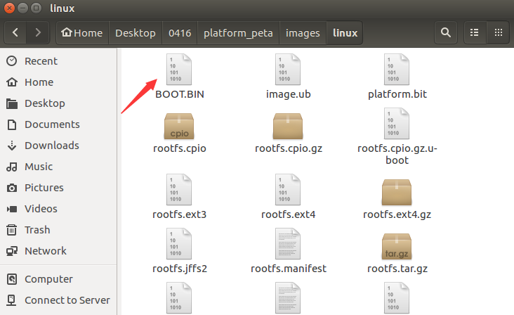

## 将 BOOT.bin 烧写进 QSPI Flash

...