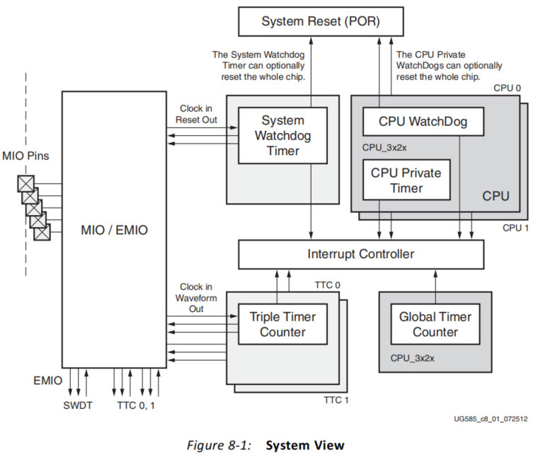
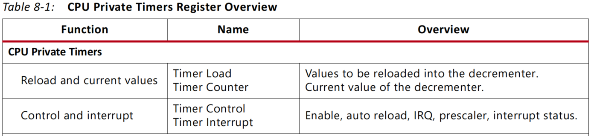
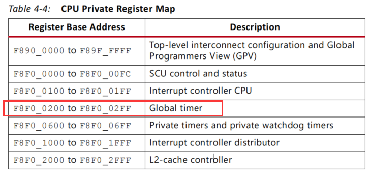
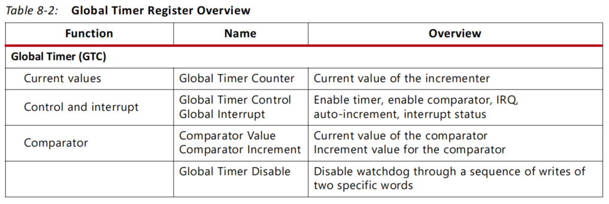

# 定时器

## 定时器简介

在 ZYNQ 嵌入式系统中，定时器的资源是非常丰富的，每个 Cortex-A9 处理器都有各自独立的 32 位私有定时器和 32 位看门狗定时器，这两个 CPU 同时共享一个 64 位的全局定时器（GT）。

## 系统框图



## 私有定时器

#### 特点

- 32 位计数器，当计数器递减至 0 时产生中断
- 8 位预分频计数器，可以更好的控制中断周期
- 可以配置单次定时或者自动重载模式
- 通过配置起始计数值来设置定时时间

#### 时钟

- 私有定时器时钟为 CPU 频率（CPU_3x2x）的一半，如 ARM 的工作时钟频率为 666.666Mhz，则私有定时器的时钟频率为 333.333Mhz。

#### 寄存器表



#### 驱动示例

- timer.c

```c
/**
 * Copyright (c) 2022-2023，HelloAlpha
 * 
 * Change Logs:
 * Date           Author       Notes
 */
#include "timer.h"

int TimerInit(XScuTimer *TimerInstancePtr, uint16_t TimerDeviceId, 
                            uint32_t TimerLoadValue)
{
    int Status;
    XScuTimer_Config *ConfigPtr;

    ConfigPtr = XScuTimer_LookupConfig(TimerDeviceId);

    Status = XScuTimer_CfgInitialize(TimerInstancePtr, ConfigPtr,
                    ConfigPtr->BaseAddr);
    if (Status != XST_SUCCESS) {
        return XST_FAILURE;
    }

    Status = XScuTimer_SelfTest(TimerInstancePtr);
    if (Status != XST_SUCCESS) {
        return XST_FAILURE;
    }

    XScuTimer_EnableAutoReload(TimerInstancePtr);

    XScuTimer_LoadTimer(TimerInstancePtr, TimerLoadValue);

    return Status;
}

int TimerIntrInit(XScuGic *IntcInstancePtr, XScuTimer *TimerInstancePtr, 
        uint32_t TimerIntrId, void(* CallBack)(void *))
{
    int Status;

    XScuGic_Config *IntcConfig;

    IntcConfig = XScuGic_LookupConfig(INTC_DEVICE_ID);
    if (NULL == IntcConfig) {
        return XST_FAILURE;
    }

    Status = XScuGic_CfgInitialize(IntcInstancePtr, IntcConfig,
                    IntcConfig->CpuBaseAddress);
    if (Status != XST_SUCCESS) {
        return XST_FAILURE;
    }

    Xil_ExceptionInit();

    Xil_ExceptionRegisterHandler(XIL_EXCEPTION_ID_INT,
            (Xil_ExceptionHandler)XScuGic_InterruptHandler,
            IntcInstancePtr);

    Xil_ExceptionEnable();

    Status = XScuGic_Connect(IntcInstancePtr, TimerIntrId,
          (Xil_ExceptionHandler)CallBack, (void *)TimerInstancePtr);
    if (Status != XST_SUCCESS) {
        return Status;
    }

    XScuGic_Enable(IntcInstancePtr, TimerIntrId);

    XScuTimer_EnableInterrupt(TimerInstancePtr);

    return XST_SUCCESS;
}
```

- timer.h

```c
/**
 * Copyright (c) 2022-2023，HelloAlpha
 * 
 * Change Logs:
 * Date           Author       Notes
 */
#ifndef __TIMER_H__
#define __TIMER_H__

#include "xscutimer.h"
#include "xscugic.h"

/* CPU时钟频率 */
#ifndef CPU_CLK_FREQ_HZ
#define CPU_CLK_FREQ_HZ     XPAR_CPU_CORTEXA9_0_CPU_CLK_FREQ_HZ
#endif

/* 私有定时器的时钟频率 = CPU时钟频率/2 = 333MHz */
#define TIMER_HZ            CPU_CLK_FREQ_HZ/2

#ifndef INTC_DEVICE_ID
#define INTC_DEVICE_ID      XPAR_SCUGIC_SINGLE_DEVICE_ID
#endif

#define TIMER_DEVICE_ID     XPAR_XSCUTIMER_0_DEVICE_ID
#define TIMER_IRPT_INTR     XPAR_SCUTIMER_INTR

/*
 * Function declaration
 */
int TimerInit(XScuTimer *TimerInstancePtr, uint16_t TimerDeviceId, 
                            uint32_t TimerLoadValue);
int TimerIntrInit(XScuGic *IntcInstancePtr, XScuTimer *TimerInstancePtr, 
        uint32_t TimerIntrId, void(* CallBack)(void *));

#endif
```

#### 应用示例

- app_timer.c

```c
/**
 * Copyright (c) 2022-2023，HelloAlpha
 * 
 * Change Logs:
 * Date           Author       Notes
 */
#include "app_timer.h"

#define USING_ULOG
#include "ulog.h"

extern XScuGic IntcInstPtr;

/**
 * @brief 定时器中断处理，中断时间 50ms
 */
void TimerIntrHandler(void *CallBackRef)
{
    XScuTimer *TimerInstancePtr = (XScuTimer *) CallBackRef;
    struct timer_flag *_timer_flag = &g_timer_flag;
    static uint16_t count = 0;
    
    /* 标志位触发 */
//	XScuTimer_IsExpired(TimerInstancePtr);
    ULOG("--- timer handle --- \r\n");

    count++;

    if(count == 101)
    {
        count = 0;
    }

    ULOG("count: %d\r\n", count);

    _timer_flag->timer_flag_50ms = 1;

    if(count % 10 == 0)
    {
        _timer_flag->timer_flag_500ms = 1;
        ULOG("--- 500 MS --- \r\n");

    }
    if(count % 20 == 0)
    {
        _timer_flag->timer_flag_1s = 1;
        ULOG("---  1 S --- \r\n");
    }

    XScuTimer_ClearInterruptStatus(TimerInstancePtr);
    /* 关闭自动重装载值 关闭中断 */
    // XScuTimer_DisableAutoReload(TimerInstancePtr);
}

int app_timer_init(void)
{
    int Status;

    Status = TimerInit(&Timer, TIMER_DEVICE_ID, TIMER_LOAD_VALUE);
    if (Status != XST_SUCCESS) {
        return XST_FAILURE;
    }
    Status = TimerIntrInit(&IntcInstPtr, &Timer, TIMER_IRPT_INTR, TimerIntrHandler);
    if (Status != XST_SUCCESS) {
        return XST_FAILURE;
    }
    XScuTimer_Start(&Timer);

    return Status;
}
```

- app_timer.h

```c
/**
 * Copyright (c) 2022-2023，HelloAlpha
 * 
 * Change Logs:
 * Date           Author       Notes
 */
#ifndef __APP_TIMER_H__
#define __APP_TIMER_H__

#include "timer.h"

/* CPU时钟频率 */
#ifndef CPU_CLK_FREQ_HZ
#define CPU_CLK_FREQ_HZ 	XPAR_CPU_CORTEXA9_0_CPU_CLK_FREQ_HZ
#endif

/* 私有定时器的时钟频率 = CPU时钟频率/2 = 333MHz */
#define TIMER_HZ 			CPU_CLK_FREQ_HZ/2

/*
 * 精确计算 装载值 = 定时时间（单位：秒）* 333333333
 * 0.5s 166,666,666.5 0x9EF21AA
 * 0.1s  333,333,33.3 0x1FCA055
 * 0.05s 16,666,666,65 0xFE502A
 */
#define TIMER_LOAD_VALUE 0xFE502A

XScuTimer Timer;

struct timer_flag
{
    char timer_flag_50ms;
    char timer_flag_500ms;
    char timer_flag_1s;
};

typedef struct timer_flag timer_flag_t;

timer_flag_t g_timer_flag;

int app_timer_init(void);

#endif
```

## 全局定时器（GTC）

全局定时器是一个具有自动递增功能的 64 位递增计数器。全局定时器将内存映射到与专用定时器相同的地址空间中。全局定时器仅在安全状态下的重置时被访问。所有 Cortex-A9 处理器都可以访问这个全局定时器。每个 Cortex-A9 处理器都有一个 64 位的比较器，当全局计时器达到比较器值时，该比较器被用来产生一个私有中断。

#### 时钟

- GTC 的时钟始终为 CPU 频率（CPU_3x2x）的 1/2。

#### 寄存器表





#### 驱动示例

- gtc.c

```c
/**
 * Copyright (c) 2022-2023，HelloAlpha
 * 
 * Change Logs:
 * Date           Author       Notes
 */
#include "gtc.h"

#include "stdio.h"

void GtStart(void)
{
    /* 启动全局定时器 */
    GT_WR_REG(GT_CTRL_REG, AUTO_INC_BIT | IRQ_ENABLE_BIT 
                | COMP_ENABLE_BIT | TMR_ENABLE_BIT);
}

int GtIntrInit(XScuGic *GtInstancePtr, 
                uint64_t Value, void(* CallBack)(void *))
{
    int Status;

    /* 停止全局定时器 */
    GT_WR_REG(GT_CTRL_REG, 0);
    /* 清空计数器低 32 位 */
    GT_WR_REG(GT_CNT_REG0, 0);
    /* 清空计数器高 32 位 */
    GT_WR_REG(GT_CNT_REG1, 0);
    /* 清除中断标志位 */
    GT_WR_REG(GT_INTR_STAT_REG, 1);
    /* 加载比较器低 32 位 */
    GT_WR_REG(COMP_VAL_REG0, (uint32_t)Value);
    /* 加载比较器高 32 位 */
    GT_WR_REG(COMP_VAL_REG1, 0);
    /* 加载递增寄存器数值 */
    GT_WR_REG(AUTO_INC_REG, (uint32_t)(Value >> 32));
    /* 绑定全局定时器中断服务函数 */
    Status = XScuGic_Connect(GtInstancePtr, GT_INTR,
        (Xil_ExceptionHandler)CallBack, 0);
    if (Status != XST_SUCCESS)
    {
        return Status;
    }
    /* 将 27 号全局定时器中断映射到 CPU1 */
    XScuGic_InterruptMaptoCpu(GtInstancePtr, 1, GT_INTR);
    /* 打开全局定时器中断（27号） */
    XScuGic_Enable(GtInstancePtr, GT_INTR);
    return Status;
}

/* 清零计数器 */
void gt_tic(void)
{
    *((volatile int*)(GT_CTRL_REG)) = 0x00;
    *((volatile int*)(GT_CNT_REG0)) = 0x00000000;
    *((volatile int*)(GT_CNT_REG1)) = 0x00000000;
    *((volatile int*)(GT_CTRL_REG)) = 0x01;
}

/** 读取计数器 输出当前时间 单位：ms
 *  可配合 gt_tic 作如下使用：
 *  {
 *      gt_tic();
 *      function_to_get_running_time();
 *      gt_toc();
 *  }
 */
double gt_toc(void)
{
    *((volatile int*)(GT_CTRL_REG)) = 0x00;
    long long cnt = *((volatile int*)(GT_CNT_REG1));
    double elapsed_time = cnt << 32;
    cnt = *((volatile int*)(GT_CNT_REG0));
    elapsed_time += cnt;
    elapsed_time /= CLK_3x2x;
    elapsed_time *= 1000;
    printf("Elapsed time is %f ms.\r\n",elapsed_time);
    return elapsed_time;
}

/* 获取当前时间（单位：秒 second） */
float get_time_s(void)
{
    XTime tCur = 0;
    XTime_GetTime(&tCur);
    return (tCur / (float) COUNTS_PER_SECOND);
}
```

- gtc.h

```c
/**
 * Copyright (c) 2022-2023，HelloAlpha
 * 
 * Change Logs:
 * Date           Author       Notes
 */
#ifndef __GTC_H__
#define __GTC_H__

#include "xtime_l.h"
#include "xscugic.h"
#include "xil_io.h"

/* 定时器寄存器 */
#define GT_BASEADDR     GLOBAL_TMR_BASEADDR
#define GT_CNT_REG0     GT_BASEADDR + GTIMER_COUNTER_LOWER_OFFSET
#define GT_CNT_REG1     GT_BASEADDR + GTIMER_COUNTER_UPPER_OFFSET
#define GT_CTRL_REG     GT_BASEADDR + GTIMER_CONTROL_OFFSET
/* 中断寄存器 */
#define GT_INTR         XPAR_GLOBAL_TMR_INTR
/* 中断状态寄存器 */
#define GT_INTR_STAT_REG    GT_BASEADDR + 0x0CU
/* 比较器 */
#define COMP_VAL_REG0       GT_BASEADDR + 0x10U
#define COMP_VAL_REG1       GT_BASEADDR + 0x14U
/* 自动递增寄存器 */
#define AUTO_INC_REG        GT_BASEADDR + 0x18U

#define AUTO_INC_BIT        0x08
#define IRQ_ENABLE_BIT      0x04
#define COMP_ENABLE_BIT     0x02
#define TMR_ENABLE_BIT      0x01

#define CLK_3x2x    333333333

#define GT_WR_REG   Xil_Out32

void GtStart(void);
int GtIntrInit(XScuGic *GtInstancePtr, 
                uint64_t Value, void(* CallBack)(void *));
void gt_tic(void);
double gt_toc(void);
float get_time_s(void);

#endif
```

**测试平台**：黑金 AX7Z035

**芯片型号**：XC7Z035-2FFG676

**参考来源：UG585**

