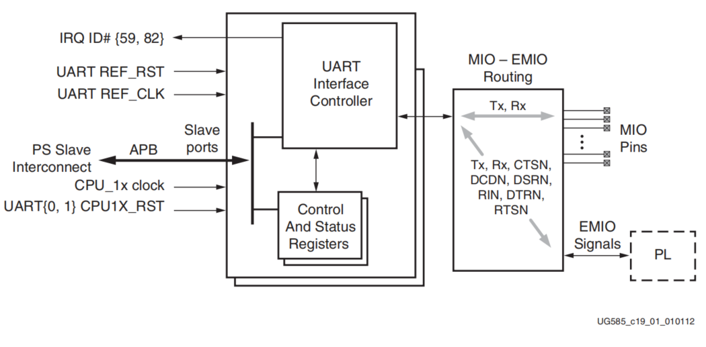
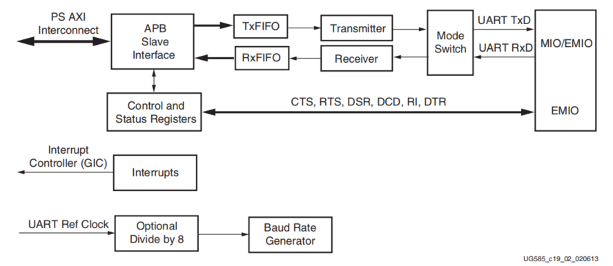
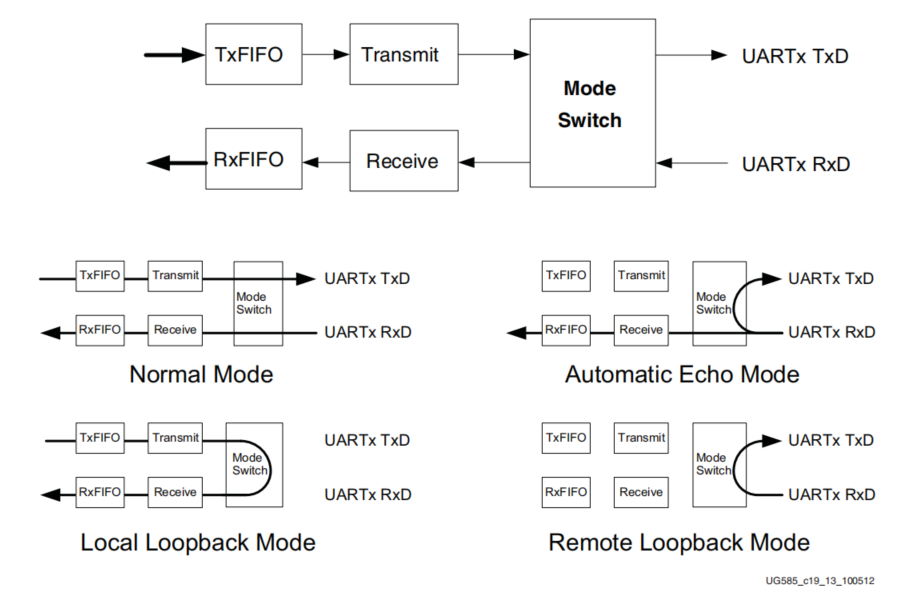
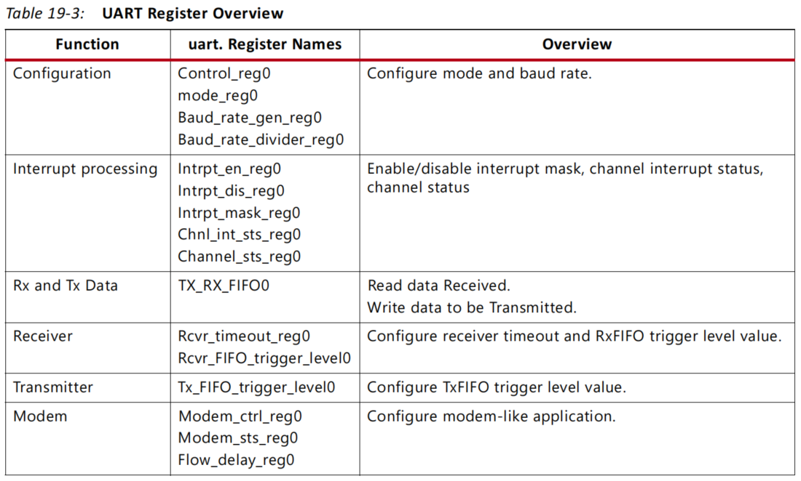

# UART 控制器

## UART 简介

我们在使用 PS 的时候，通常会添加 UART 控制器，用于打印信息和调试代码。除此之外，PS 在和外
部设备通信时，也会经常使用串口进行通信。
## UART 控制器

UART 控制器是一个全双工异步收发控制器，ZYNQ 内部包含两个 UART 控制器，UART0 和 UART1。每一个 UART 控制器支持可编程的波特率发生器、64 字节的接收 FIFO 和发送 FIFO、产生中断、RXD 和 TXD 信号的环回模式设置以及可配置的数据位长度、停止位和校验方式等。
UART 控制器系统框图如图所示：



由上图可知，UART 控制器和 IO 端口由参考时钟（UART REF_CLK）驱动，同时控制器也需要连接 APB 总线时钟（CPU_1x clock），UART REF_CLK 和 CPU_1x clock 都是来自于 PS 时钟子系统。UART 控制器的配置以及状态的获取由控制（Control）和状态寄存器（Status Registers）完成。

另外，UART 控制器不仅可以连接至 MIO，也可以映射到 EMIO，从而使用 PL 的端口来实现串口通信的功能。当 UART 控制器连接到 MIO 时，只有 Tx（发送）和 Rx（接收）两个引脚；而当连接 EMIO 时，除 Tx 和 Rx 引脚外，可选的还有 CTSN、DSDN、DSRN 等引脚，这些引脚用于串口的流控制，即调制解调器的数据通讯中。

UART 控制器采用独立的接收和发送数据路径，每个路径包含一个 64 字节的 FIFO，控制器对发送和接收 FIFO 中的数据进行串并转换操作。FIFO 的中断标志支持轮询处理或中断驱动处理两种方式。另外，控制器中还有一个模式开关，支持 RXD 和 TXD 信号的各种环回配置。UART 控制器内部框图如下图所示：



UART 控制器的寄存器通过 APB 从机接口和 PS AXI 总线互联，控制器的寄存器用于对 UART 控制器进行配置和获取状态。波特率发生器（Baud Rate Generator）为 UART 控制器的接收端和发送端提供位周期时钟；中断控制器（GIC）为串口的收发提供了中断服务的功能。

APB 总线接口通过向 TxFIFO 寄存器写值，将数据加载到 TxFIFO 存储器中。当数据加载至 TxFIFO 后，TxFIFO 的空标志变成无效的状态，直到最后一个数据从 TxFIFO 中移出，加载至传输移位寄存器，TxFIFO 恢复空的标志位。同时 TxFIFO 使用 TFULL（满中断状态）用于表示当前 TxFIFO 已经写满，并且会阻止数据继续写入。如果此时继续执行写操作，那么会触发溢出，数据不会加载到 TxFIFO 中。RxFIFO 存储器接收来自接收移位寄存器的数据，当接收完数据后，RxFIFO 空标志信号同样变成无效的状态，直到所有的数据通过 APB 总线发送出去。RxFIFO 的满标志状态用于表示 RxFIFO 已经写满，并且会阻止更多的数据写入。

## Mode Switch

模式切换（Mode Switch）控制器控制 RxD 和 TxD 的信号连接方式，总共分为四种模式，分别为：正常模式（Normal Mode）、自动回音模式（Automatic Echo Mode）、本地环回模式（Local Loopback Mode）和远程环回模式（Remote Loopback Mode）。模式切换的功能示意图如所示：



从上图中可以清晰的看出 UART 不同模式下所实现的功能。在实际应用中，最常用的就是 UART 的正常模式。

- 正常模式是标准的 UART 操作模式；
- 自动回音模式下，RxD 连接至 TxD，控制器可以接收数据，但是不能发送数据；
- 本地环回模式没有连接 RxD 和 TxD 的引脚，用于本地程序的环回测试；
- 远程环回模式下，RxD 连接至 TxD，但是并没有和控制器连接，因此控制器在此模式下无法发送数据和接收数据。

## UART寄存器

UART 寄存器概述如下表所示。



## 驱动示例

- uart.c

```c
/**
 * Copyright (c) 2022-2023，HelloAlpha
 * 
 * Change Logs:
 * Date           Author       Notes
 */
#include "uart.h"

/**
 * @brief 串口初始化
 * 
 * @param UartInstancePtr 串口实例
 * @param UartFormat 串口通信格式
 * @param UartDeviceId 串口 ID 号
 * @return int 
 */
int UartInit(XUartPs* UartInstancePtr, XUartPsFormat* UartFormat, uint16_t UartDeviceId)
{
    int Status;
    XUartPs_Config *UartConfigPtr;

    UartConfigPtr = XUartPs_LookupConfig(UartDeviceId);
    if (NULL == UartConfigPtr) {
        return XST_FAILURE;
    }

    Status = XUartPs_CfgInitialize(UartInstancePtr, UartConfigPtr, 
                        UartConfigPtr->BaseAddress);
    if (Status != XST_SUCCESS) {
        return XST_FAILURE;
    }

    Status = XUartPs_SelfTest(UartInstancePtr);
    if (Status != XST_SUCCESS) {
        return XST_FAILURE;
    }

    /* Set UART mode Baud Rate 115200, 8bits, no parity, 1 stop bit */
    XUartPs_SetDataFormat(UartInstancePtr, UartFormat) ;
    /* Set the UART in Normal Mode */
    XUartPs_SetOperMode(UartInstancePtr, XUARTPS_OPER_MODE_NORMAL);

    return Status;
}

/**
 * @brief 串口中断初始化
 * 
 * @param IntcInstancePtr 中断实例
 * @param UartInstancePtr 串口中断实例
 * @param UartIntrId 串口中断 ID 号
 * @param CallBack 中断服务函数
 * @return int 
 */
int UartIntrInit(XScuGic *IntcInstancePtr,	XUartPs *UartInstancePtr, 
        uint32_t UartIntrId, void(* CallBack)(void *))
{
    int Status;

    XScuGic_Config *IntcConfig;

    IntcConfig = XScuGic_LookupConfig(INTC_DEVICE_ID);
    if (NULL == IntcConfig) {
        return XST_FAILURE;
    }

    Status = XScuGic_CfgInitialize(IntcInstancePtr, IntcConfig,
            IntcConfig->CpuBaseAddress);
    if (Status != XST_SUCCESS) {
        return XST_FAILURE;
    }

    Xil_ExceptionInit();
    Xil_ExceptionRegisterHandler(XIL_EXCEPTION_ID_INT,
            (Xil_ExceptionHandler) XScuGic_InterruptHandler,
            IntcInstancePtr);
    Xil_ExceptionEnable();

    Status = XScuGic_Connect(IntcInstancePtr, UartIntrId,
            (Xil_ExceptionHandler) CallBack,
            (void *) UartInstancePtr);
    if (Status != XST_SUCCESS) {
        return XST_FAILURE;
    }

    /* Set the receiver timeout.*/
    XUartPs_SetRecvTimeout(UartInstancePtr, 8);

    /*Set receiver FIFO interrupt trigger level, here set to 1*/
    XUartPs_SetFifoThreshold(UartInstancePtr, 1);
    /* 设置中断触发类型 */
    XUartPs_SetInterruptMask(UartInstancePtr, 
                        XUARTPS_IXR_RXOVR | XUARTPS_IXR_RXEMPTY | XUARTPS_IXR_TOUT);
    XScuGic_Enable(IntcInstancePtr, UartIntrId);

    return Status ;
}

/**
 * @brief 串口数据发送函数
 * 
 * @param InstancePtr 串口实例
 * @param BufferPtr 发送缓冲区指针
 * @param NumBytes 要发送的字节数
 * @return int 成功发送的字节数
 */
int UartPsSend(XUartPs *InstancePtr, uint8_t *BufferPtr, uint32_t NumBytes)
{
    uint32_t SentCount = 0U;

    /* Setup the buffer parameters */
    InstancePtr->SendBuffer.RequestedBytes = NumBytes;
    InstancePtr->SendBuffer.RemainingBytes = NumBytes;
    InstancePtr->SendBuffer.NextBytePtr = BufferPtr;


    while (InstancePtr->SendBuffer.RemainingBytes > SentCount)
    {
        /* Fill the FIFO from the buffer */
        if (!XUartPs_IsTransmitFull(InstancePtr->Config.BaseAddress))
        {
            XUartPs_WriteReg(InstancePtr->Config.BaseAddress,
                    XUARTPS_FIFO_OFFSET,
                    ((uint32_t)InstancePtr->SendBuffer.
                            NextBytePtr[SentCount]));

            /* Increment the send count. */
            SentCount++;
        }
    }

    /* Update the buffer to reflect the bytes that were sent from it */
    InstancePtr->SendBuffer.NextBytePtr += SentCount;
    InstancePtr->SendBuffer.RemainingBytes -= SentCount;

    return SentCount;
}

/**
 * @brief 串口数据接收函数
 * 
 * @param InstancePtr 串口实例
 * @param BufferPtr 接收缓冲区指针
 * @param NumBytes 要读取的字节数
 * @return int 成功读取的字节数
 */
int UartPsRev(XUartPs *InstancePtr, uint8_t *BufferPtr, uint32_t NumBytes)
{
    uint32_t ReceivedCount = 0;
    uint32_t CsrRegister;

    /* Setup the buffer parameters */
    InstancePtr->ReceiveBuffer.RequestedBytes = NumBytes;
    InstancePtr->ReceiveBuffer.RemainingBytes = NumBytes;
    InstancePtr->ReceiveBuffer.NextBytePtr = BufferPtr;

    /*
     * Read the Channel Status Register to determine if there is any data in
     * the RX FIFO
     */
    CsrRegister = XUartPs_ReadReg(InstancePtr->Config.BaseAddress,
            XUARTPS_SR_OFFSET);

    /*
     * Loop until there is no more data in RX FIFO or the specified
     * number of bytes has been received
     */
    while((ReceivedCount < InstancePtr->ReceiveBuffer.RemainingBytes)&&
            (((CsrRegister & XUARTPS_SR_RXEMPTY) == (u32)0)))
    {
        InstancePtr->ReceiveBuffer.NextBytePtr[ReceivedCount] =
                XUartPs_ReadReg(InstancePtr->Config.BaseAddress, XUARTPS_FIFO_OFFSET);

        ReceivedCount++;

        CsrRegister = XUartPs_ReadReg(InstancePtr->Config.BaseAddress,
                XUARTPS_SR_OFFSET);
    }
    InstancePtr->is_rxbs_error = 0;
    /*
     * Update the receive buffer to reflect the number of bytes just
     * received
     */
    if(NULL != InstancePtr->ReceiveBuffer.NextBytePtr){
        InstancePtr->ReceiveBuffer.NextBytePtr += ReceivedCount;
    }
    InstancePtr->ReceiveBuffer.RemainingBytes -= ReceivedCount;

    return ReceivedCount;
}

/**
 * @brief 串口波特率更改
 * 
 * @param UartDeviceId 串口 ID 号
 * @param Baudrate 要设置的波特率
 * @return int 
 */
int UartSetBaudRate(uint16_t UartDeviceId , uint32_t Baudrate)
{
    static XUartPs Uart;
    XUartPs_Config *UartConfigPtr;
    UartConfigPtr = XUartPs_LookupConfig(UartDeviceId);
    if (NULL == UartConfigPtr) {
        return XST_FAILURE;
    }
    XUartPs_CfgInitialize(&Uart, UartConfigPtr, UartConfigPtr->BaseAddress);
    XUartPs_SetBaudRate(&Uart, Baudrate);
    return XST_FAILURE;
}

```

- uart.h

```c
/**
 * Copyright (c) 2022-2023，HelloAlpha
 * 
 * Change Logs:
 * Date           Author       Notes
 */
#ifndef __UART_H__
#define __UART_H__

#include "xuartps.h"
#include "xscugic.h"

#ifndef INTC_DEVICE_ID
#define INTC_DEVICE_ID      XPAR_SCUGIC_SINGLE_DEVICE_ID
#endif

#define UART0_DEVICE_ID     XPAR_XUARTPS_0_DEVICE_ID
#define UART1_DEVICE_ID     XPAR_XUARTPS_1_DEVICE_ID
#define UART0_IRPT_INTR     XPAR_XUARTPS_0_INTR
#define UART1_IRPT_INTR     XPAR_XUARTPS_1_INTR

/*
 * Function declaration
 */
int UartInit(XUartPs* UartInstancePtr, XUartPsFormat* UartFormat, uint16_t UartDeviceId);
int UartIntrInit(XScuGic *IntcInstancePtr,	XUartPs *UartInstancePtr, 
        uint32_t UartIntrId, void(* CallBack)(void *));
int UartPsSend(XUartPs *InstancePtr, uint8_t *BufferPtr, uint32_t NumBytes) ;
int UartPsRev (XUartPs *InstancePtr, uint8_t *BufferPtr, uint32_t NumBytes) ;
int UartSetBaudRate(uint16_t UartDeviceId , uint32_t Baudrate);

#endif
```

## 应用示例

- 初始化串口一

- app_uart.c

```c
/**
 * Copyright (c) 2022-2023，HelloAlpha
 * 
 * Change Logs:
 * Date           Author       Notes
 */
#include "app_uart.h"

#define UART0_BAUDRATE   115200U

extern XScuGic IntcInstPtr;

static XUartPsFormat _Uart0Format = {UART0_BAUDRATE, 8, 0, 1};

/**
 * @brief Interrupt handling functions
 *  
 * @param CallBackRef is a pointer to an upper-level callback reference
 */
static void Uart0Handler(void *CallBackRef)
{
    XUartPs *UartInstancePtr = (XUartPs *) CallBackRef;
    struct uart_msg *_uart0_msg = &g_uart0_msg;
    static uint32_t ReceivedCount = 0;
    static uint32_t UartSrValue = 0;

    _uart0_msg->ReceivedFlag = 0 ;

    /* Read interrupt status and enable bits */
    UartSrValue = XUartPs_ReadReg(UartInstancePtr->Config.BaseAddress, XUARTPS_IMR_OFFSET);
    UartSrValue &= XUartPs_ReadReg(UartInstancePtr->Config.BaseAddress, XUARTPS_ISR_OFFSET);

    /* check if receiver FIFO trigger */
    if (UartSrValue & XUARTPS_IXR_RXOVR)
    {
        ReceivedCount = UartPsRev(UartInstancePtr, _uart0_msg->ReceivedBufferPtr, UART_MSG_MAX_LEN);
        _uart0_msg->ReceivedByteNum += ReceivedCount;
        _uart0_msg->ReceivedBufferPtr += ReceivedCount;
    }
    /* check if receiver FIFO empty */
    if (UartSrValue & XUARTPS_IXR_RXEMPTY)
    {
        /* do nothing */
    }
    /* check if it is a timeout interrupt */
    if (UartSrValue & XUARTPS_IXR_TOUT)
    {
        _uart0_msg->ReceivedFlag = 1;
    }

    /* clear trigger interrupt */
    XUartPs_WriteReg(UartInstancePtr->Config.BaseAddress, XUARTPS_ISR_OFFSET, UartSrValue);
}

int app_uart_init(void)
{
    int Status;
    XUartPs *_Uart0_Ps = &Uart0_Ps;

    /* init UART */
    Status = UartInit(&Uart0_Ps, &_Uart0Format, UART0_DEVICE_ID);
    if (Status != XST_SUCCESS) {
        return XST_FAILURE;
    }

    /* init UART interrupt */
    Status = UartIntrInit(&IntcInstPtr, &Uart0_Ps, UART0_IRPT_INTR, Uart0Handler);
    if (Status != XST_SUCCESS) {
        return XST_FAILURE;
    }

    /* clear trigger interrupt */
    XUartPs_WriteReg(_Uart0_Ps->Config.BaseAddress, XUARTPS_ISR_OFFSET, XUARTPS_IXR_MASK);

    return XST_SUCCESS;
}
```

- app_uart.h

```c
/**
 * Copyright (c) 2022-2023，HelloAlpha
 * 
 * Change Logs:
 * Date           Author       Notes
 */
#ifndef __APP_UART_H__
#define __APP_UART_H__

#include "uart.h"

/* maximum receiver length */
#define UART_MSG_MAX_LEN    100

struct uart_msg 
{
    uint8_t ReceivedBuffer[UART_MSG_MAX_LEN];
    uint8_t *ReceivedBufferPtr;
    uint32_t ReceivedByteNum;
    char ReceivedFlag;
    uint8_t SendBuffer[UART_MSG_MAX_LEN];
    uint8_t *SendBufferPtr;
    uint32_t SendByteNum;
};

typedef struct uart_msg uart_msg_t;

XUartPs Uart0_Ps;

uart_msg_t g_uart0_msg;

int app_uart_init(void);
int uart_msg_print(void);
int uart_lookback_test(void);
int uart_report(uint8_t dev, uint8_t err);

#endif
```

**测试平台**：黑金 AC7Z035B

**芯片型号**：XC7Z035-2FFG676

**参考来源：UG585**