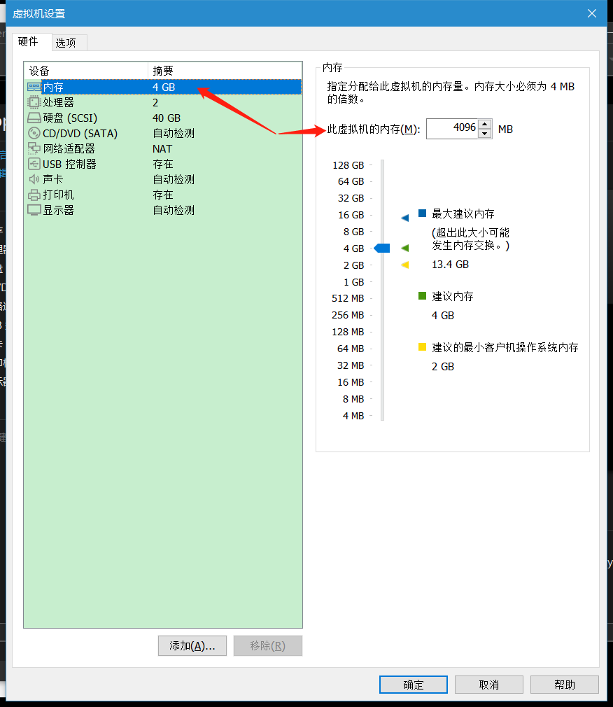
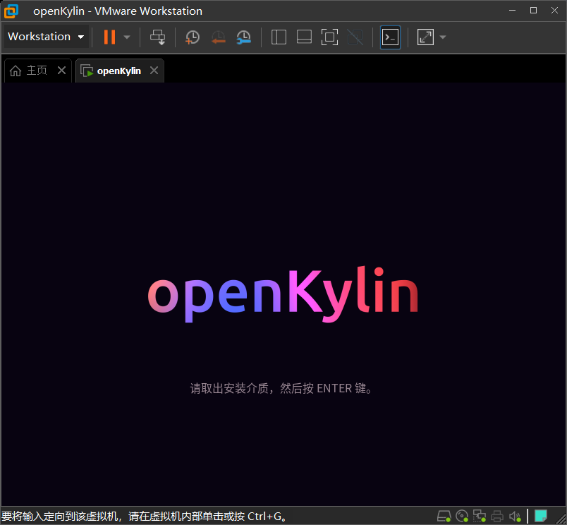
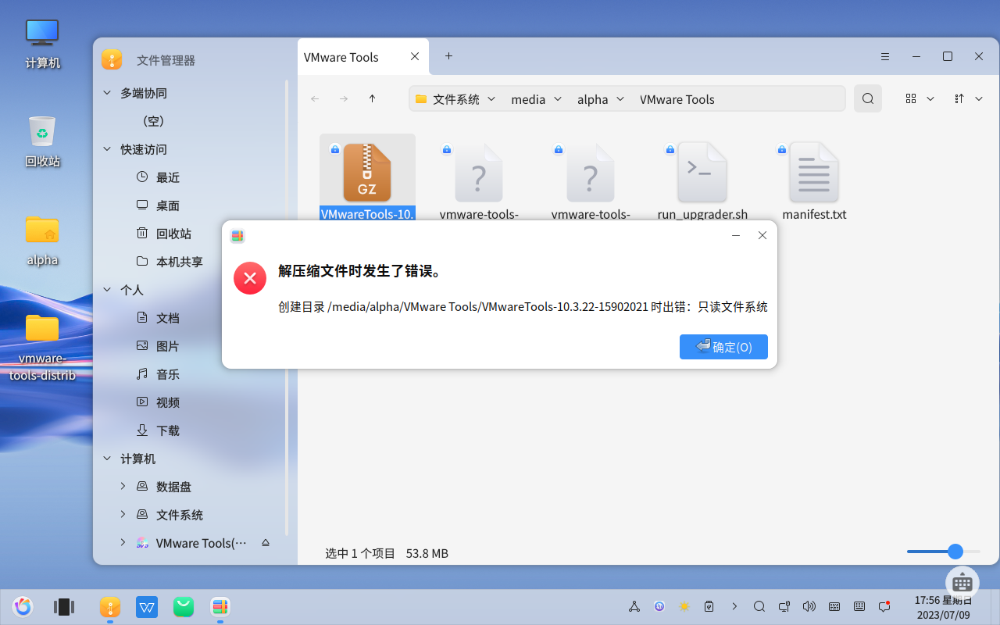

# VMware + openKylin 尝鲜“开放麒麟1.0”

7月5日，我国首个开源桌面操作系统“开放麒麟1.0”正式发布，标志着我国拥有了操作系统组件自主选型、操作系统独立构建的能力，填补了我国在这一领域的空白。

本期分享通过虚拟机 Vmware 安装 openKylin 操作系统的方式，来尝鲜一下“开放麒麟1.0”。

## 资源获取

- 资源包获取[链接](https://pan.baidu.com/s/1B4Gm0UvTiDJ1X-CbNFq3AQ?pwd=ks33)，包含 VMware 16 安装包和 openKylin 1.0 镜像文件。

- 镜像文件也可以从[麒麟](https://www.openkylin.top/index-cn.html)官网获取，点击`镜像下载`

- 找到系统下载 `openKylin 1.0 X86`，点击`64位下载`

## 创建虚拟机

- 打开虚拟机，点击`创建新的虚拟机`

- 选择典型安装，点击`下一步`

- 选择`稍后安装操作系统`，点击`下一步`

- 客户机操作系统选择 `Linux`，版本为 `Ubuntu 64位`，点击`下一步`

- 填写虚拟机名称，浏览选择安装位置，点击`下一步`

- 设置最大磁盘大小，选择`将虚拟磁盘拆分成多个文件`，点击`下一步`

- 点击`完成`创建虚拟机

- 点击`编辑此虚拟机设置`

- 在这里可以配置虚拟机内存的大小

- 在这里可以配置处理器内核总数

- 选择`使用ISO映像文件`，浏览选择镜像文件

- 这里可以配置网络适配器，保持默认即可

- 其他选项保持默认即可，点击`完成`虚拟机设置

- 点击`开启此虚拟机`

- So cool~

- 进入系统后，双击`安装openKylin`进入安装程序

- 默认选择`中文(简体)`，点击`下一步`

- 默认选择时区，点击`下一步`

- 填写用户信息及密码，可以勾选开机自动登录，点击`下一步`

- 选择`全盘安装`，选中磁盘图标，点击`下一步`

- 勾选`格式化整个磁盘`，点击`开始安装`

- 安装进行中...

- 安装完成，点击`现在重启`

- 根据提示，按一下 `ENTER 键`

- 安装完成，可以在设置中配置分辨率，使之更契合屏幕大小，尽情享用~

## 虚拟机工具安装

- 点击菜单栏`虚拟机--->安装vmware-tools` 或者点击虚拟机底部弹出的`安装 Tools`下载虚拟机工具安装包

- 点击右下角弹出的消息或从文件浏览器直接打开

- 如果直接右键解压压缩包会提示文件只读，解压错误

- 笔者尝试过修改文件权限也无济于事

- 此时可以双击打开压缩文件，选中其中的文件，点击`解压缩`

- 选择解压到`桌面`，点击`解压缩`

- 双击打开文件夹，空白处右键点击`打开终端`，输入命令运行 `vmware-install.pl` 文件

- 提示权限不足

- 使用 sudo 命令提升权限

- 需要输入密码（密码在输入时不显示）

- 一路回车，遇到 (yes) 时输入 y，(no) 输入 n 即可

- 安装完成~

- Perfect！

